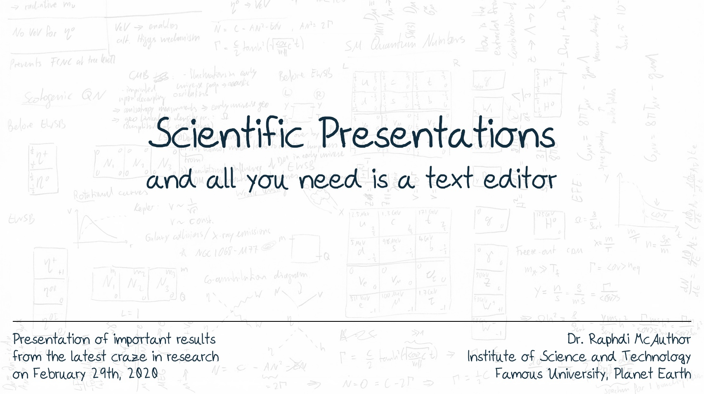
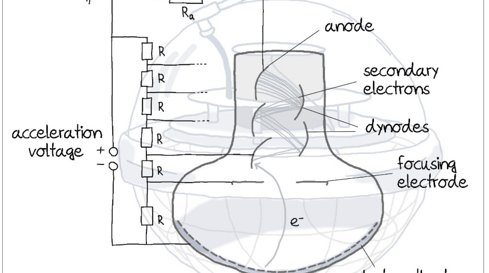
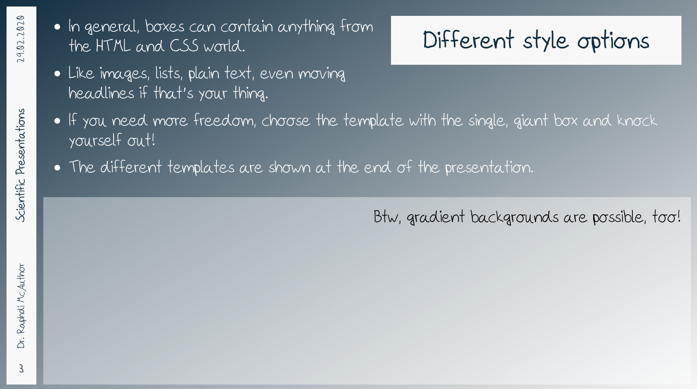
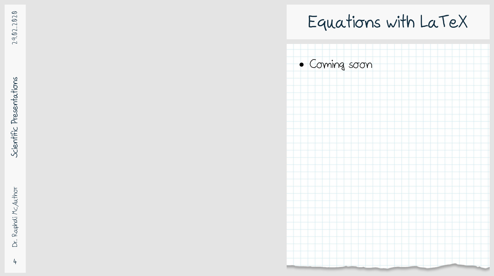
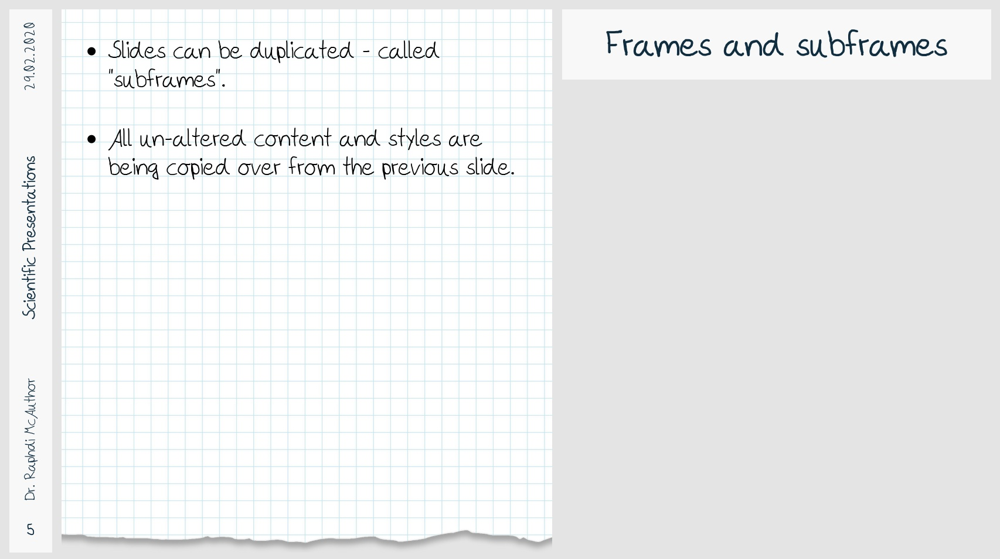
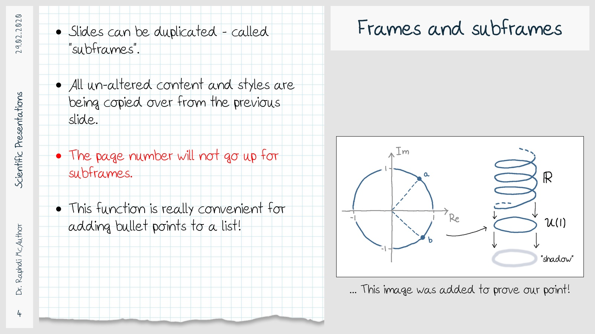
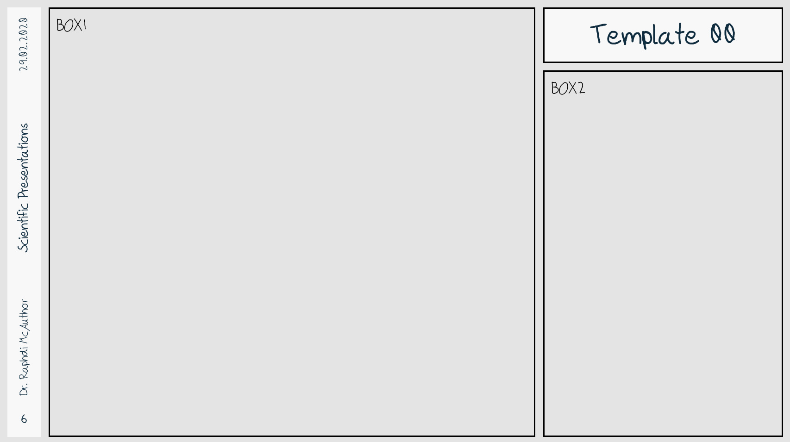
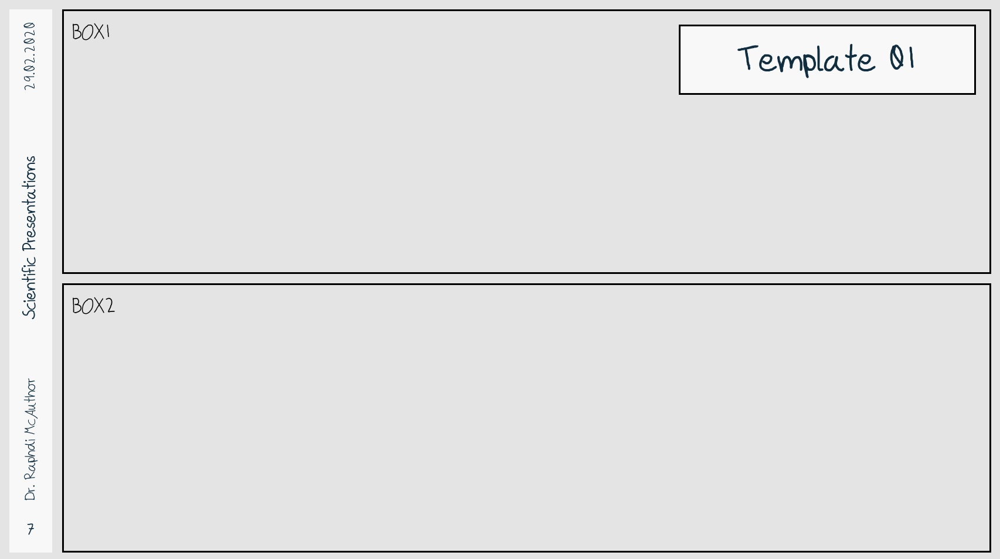
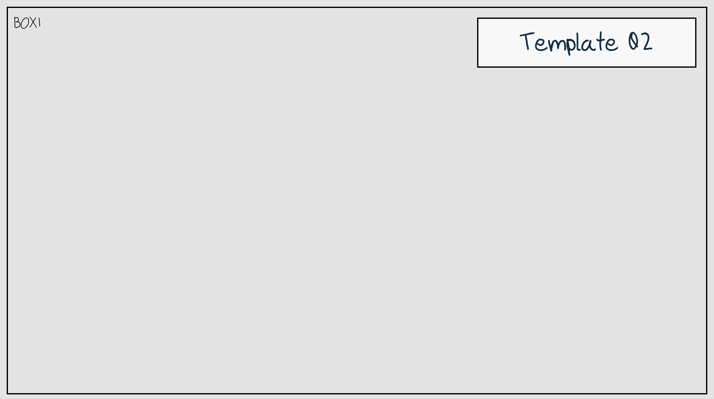
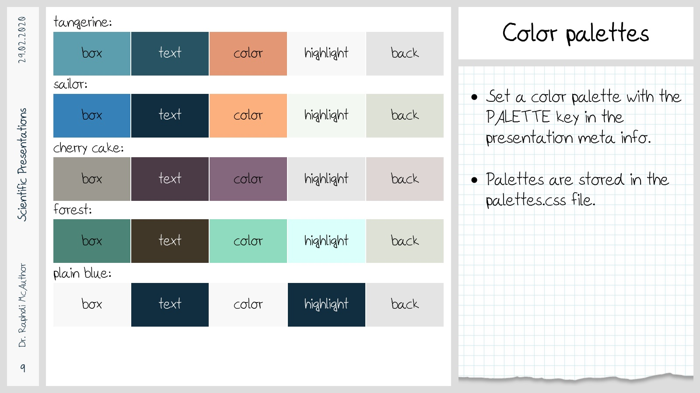

# neftox
An open source tool for creating highly-personalized, scientific and visually appealing presentation slides in a text editor.


### About
In the recent years, the author became increasingly frustrated with tools designed to create presentation slides. They are either expensive, not available for Linux, extremely awkward to use, unsupportive of scientific expressions and symbols, or do not provide enough flexibility for giving your presentation a personal touch. Often enough, more than one from that list.
But there exists a field that offers sheer unlimited possibilities for front-end arrangements, with tools that everyone can learn to use in a matter of days: Web design. So why not use it to create presentations?

The neftox tools is text-editor based (it does not come with a graphical interface). The user does not need special programming knowledge to use it; the tutorial serves as a copy-and-paste resource and provides enough examples for a simple presentation. For more complex presentations, some basic knowledge of HTML and CSS scripting languages is recommended. Neftox can also understand LaTeX expressions for the creation of scientific content.

Neftox is designed to combine the best from two worlds: The freedom and flexibility of web designing, with the possibilities of scientific document typesetting tools.

This is how it works: Basically, neftox creates a "website" (without being on the web of course) based on the user's input, see `tutorial/parse/output.html`. Then it takes screenshots of this website in the background, splitting it into individual images, see `tutorial/parse/output_<>.jpg`, which are then converted to a PDF, see `tutorial/tutorial.pdf`.


### Prerequisites

The Python3 modules that are required for neftox to work are listed in the `requirements.txt`.

If you want to use LaTeX expressions in your presentation, you also need a working TeX Live installation.

The process of taking screenshots with selenium uses the Mozilla Firefox browser by default, but Chromium or Google-Chrome work as well. Firefox comes with a web driver, but Chrome(ium) might require the separate installation of a driver (e.g. `chromium-chromedriver`); for more information refer to the [selenium driver website](https://www.selenium.dev/documentation/webdriver/getting_started/install_drivers/).


### Usage

```
./neftox.py <presentation dir> <option>
```

Available options:
```
--html        # Create browser output
--preview     # Create a preview with JPG images
--pdf         # Create PDF presentation
```

For long presentations, it may take a minute to create the preview images and PDF, so it is recommended to use the `--html` option while working on the presentation.


### Example slides

The following example slides have been created with the neftox tutorial:











