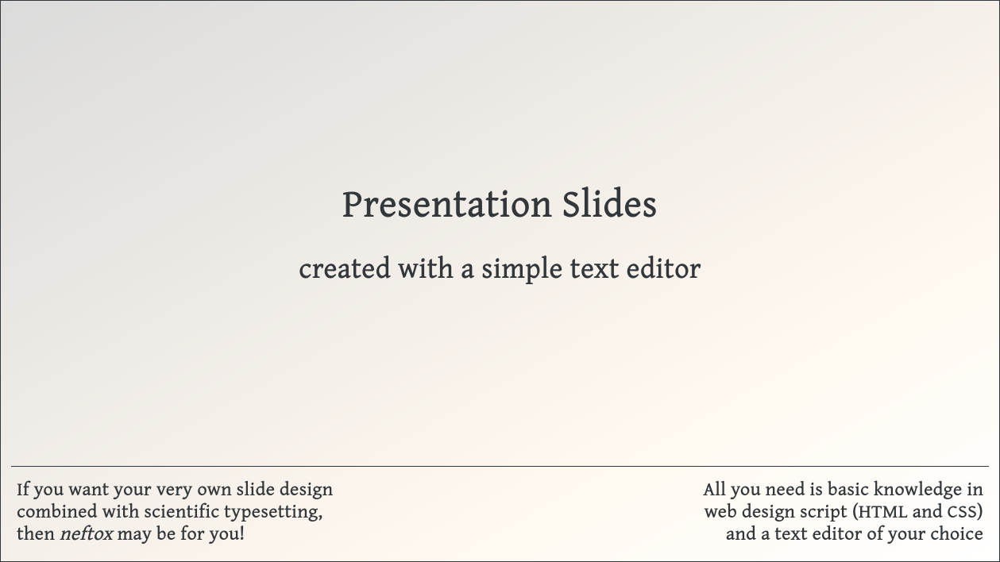
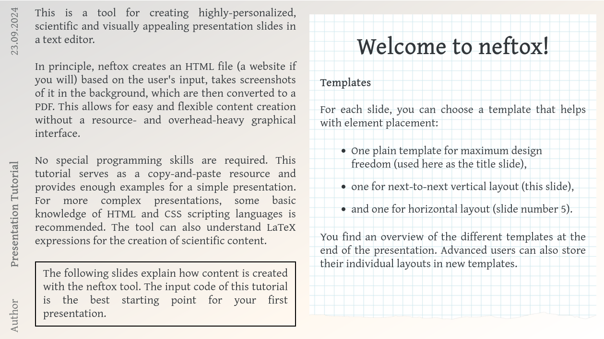
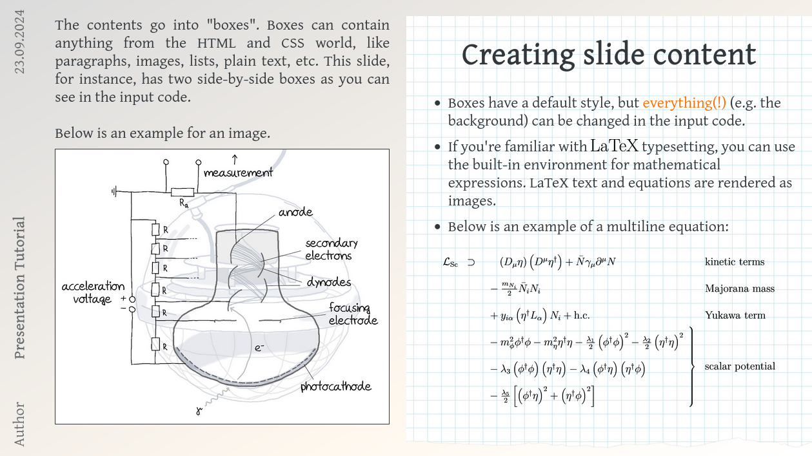
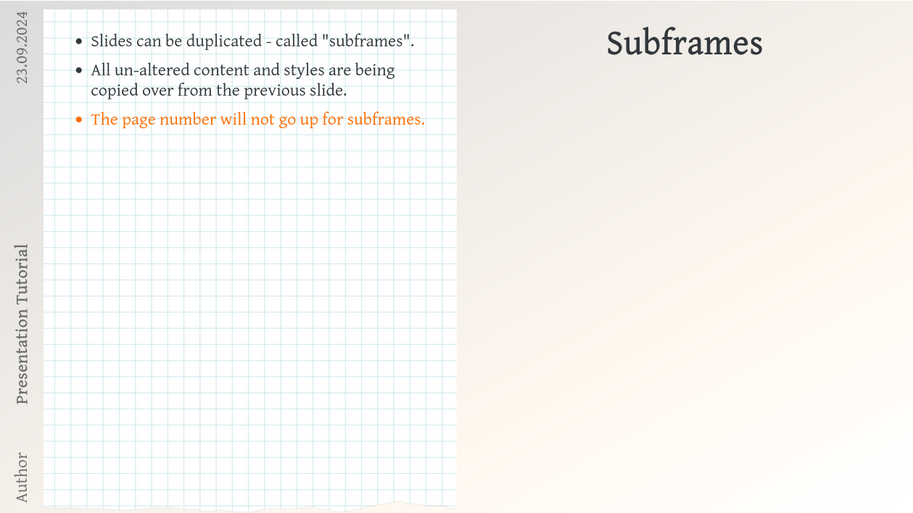
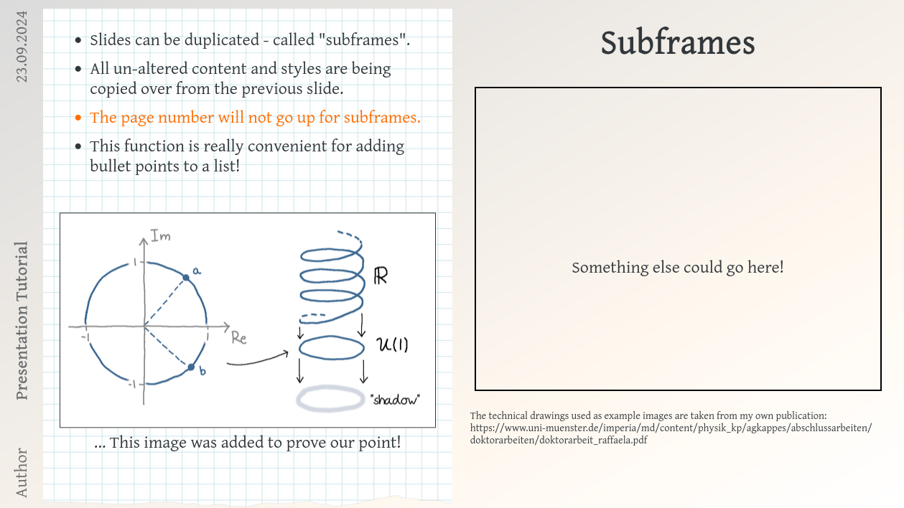
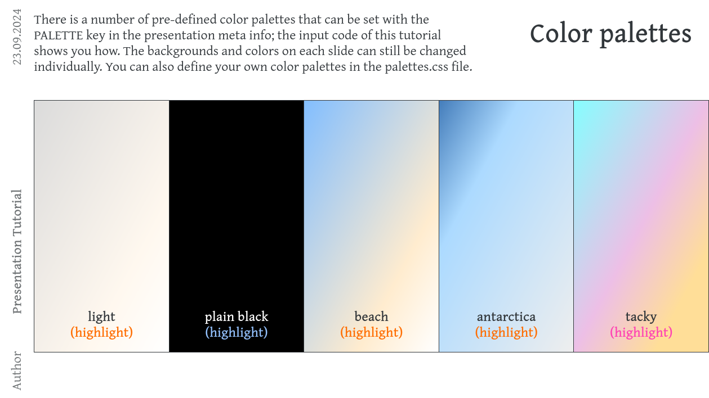
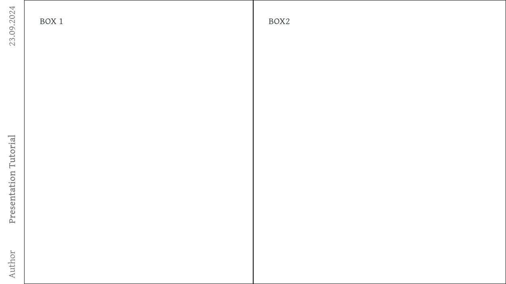

# neftox
A tool for creating highly-personalized, scientific and visually appealing presentation slides in a text editor.

In principle, neftox creates an HTML file (a website if you will)  based on the user's input, takes screenshots of it in the background, which are then converted to a PDF. This allows for easy and flexible content creation without a resource- and overhead-heavy graphical interface.

No special programming skills are required. The tool comes with a tutorial which serves as a copy-and-paste resource and provides enough examples for a simple presentation. For more complex presentations, some basic knowledge of HTML and CSS scripting languages is recommended. The tool can also understand LaTeX expressions for the creation of scientific content.


### Prerequisites

The Python3 modules that are required for neftox to work are listed in the `requirements.txt`.

If you want to use LaTeX expressions in your presentation, you also need a working TeX Live installation.

The process of taking screenshots with selenium uses the Mozilla Firefox browser by default, but Chromium or Google-Chrome work as well. Firefox comes with a web driver, but Chrome(ium) might require the separate installation of a driver (e.g. `chromium-chromedriver`); for more information refer to the [selenium driver website](https://www.selenium.dev/documentation/webdriver/getting_started/install_drivers/).

Last but not least, a text editor is required for content creation. Any text editor will do.


### Usage

```
./neftox.py <presentation dir> <option>
```

Available options:
```
--html        # Create browser output
--preview     # Create a preview with PNG images
--pdf         # Create PDF presentation
```

For long presentations, it may take a minute to create the preview images and PDF, so it is recommended to use the `--html` option while working on the presentation.
If this is your first time using neftox, it is recommended to use the tutorial as a starting point.


### Example slides

The following example slides have been created with the neftox talk tutorial:










